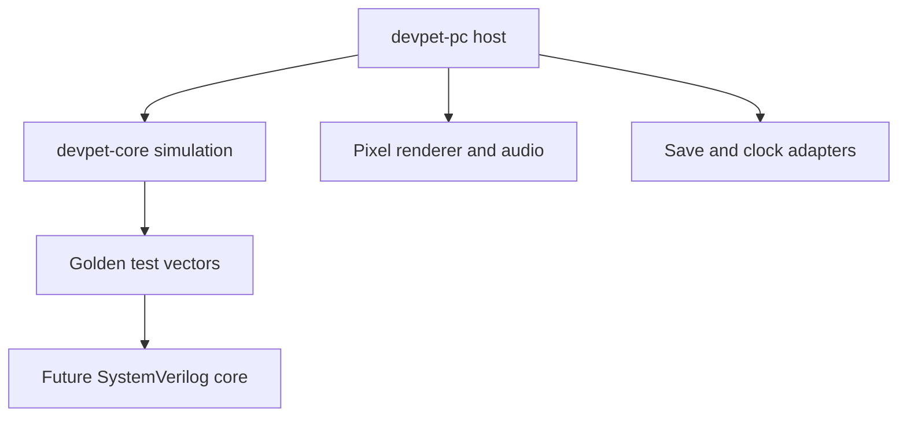

# DevPet PC MVP Plan

## 1. Product goal

Build a small, original virtual-pet game that runs natively on a PC and serves as the executable reference model for a future Analogue Pocket openFPGA core.

The MVP should answer three questions:

1. Is the minute-to-minute care loop enjoyable?
2. Do care choices create understandable but surprising evolution outcomes?
3. Can the simulation remain deterministic and simple enough to reproduce later in hardware?

This is a clean-room original project. The game may learn from virtual-pet conventions, but it will not copy Tamagotchi or Digimon code, characters, names, sounds, graphics, or data.

## 2. MVP player experience

A player launches DevPet, receives an egg, and hatches a creature named Byte. Byte continues to live while the app is closed. The player checks needs, feeds it, plays a short minigame, lets it rest, treats sickness, and sees it evolve according to care history.

The first complete play loop is:

1. Start a new save.
2. Hatch an egg into Byte.
3. Read Byte's current needs from icons and a status screen.
4. Feed, play, rest, or treat Byte.
5. Close and reopen the game without losing state.
6. Apply elapsed time while the game was closed.
7. Reach one of three first-generation evolutions: Bot, Beast, or Ghost.

### MVP features

- One local pet and one save slot
- Egg and hatch sequence
- Idle, happy, hungry, sleeping, sick, eating, and playing animations
- Integer stats for fullness, happiness, health, energy, discipline, age, and care mistakes
- Fixed-step need decay driven by a host-provided clock
- Feed, play, rest, medicine, and status actions
- One timing-based minigame
- Three evolution outcomes driven by care history
- Automatic save, load, and offline time progression
- Sound toggle and a minimal original sound set
- Keyboard and gamepad controls
- Developer fast-clock mode for testing multi-day behavior

### Explicit non-goals

- Analogue Pocket bitstream or openFPGA packaging
- Networking, accounts, cloud saves, multiplayer, or trading
- Mobile support
- Multiple pets or breeding
- Procedural dialogue or generative AI
- Modding tools or an in-game editor
- Permanent pet death in the first MVP
- High-resolution art, complex physics, or a general-purpose game engine

When health reaches its minimum, Byte becomes sick and enters a recoverable low-activity state. Permanent death can be evaluated after playtesting.

## 3. Technical direction

Use a Rust workspace with a framework-independent simulation crate and a thin Macroquad desktop shell.

| Layer | Choice | Reason |
| --- | --- | --- |
| Simulation | Rust library crate | Strong types, straightforward tests, and explicit integer state |
| PC host | Macroquad | Small native game loop with keyboard, gamepad, audio, and 2D rendering |
| Persistence | Versioned JSON through Serde | Human-readable saves during development and easy migration testing |
| Logical display | 160 x 144 pixels | A useful Pocket-aligned constraint and clean integer scaling on PC |
| Art | Original indexed-color pixel sprites | Keeps the asset budget small and future hardware implementation realistic |
| Testing | Rust unit, integration, and golden-vector tests | Lets the PC simulation become an oracle for the later RTL port |
| Automation | GitHub Actions | Repeatable format, lint, test, and desktop build checks |

Macroquad is deliberately confined to the PC shell. The simulation must not know about windows, rendering, audio, the filesystem, or wall-clock APIs.



## 4. Hardware-friendly rules

These rules keep the PC prototype useful when the openFPGA work begins:

- Use integers for all gameplay calculations; no floating-point values in `devpet-core`.
- Advance the simulation through an explicit `tick` or `advance_minutes` API.
- Inject time, input events, and random seeds from the host.
- Use a small deterministic pseudorandom generator with its state included in the save.
- Prefer enums, fixed-size records, bounded counters, and lookup tables.
- Keep renderer state separate from authoritative pet state.
- Avoid threads, asynchronous gameplay logic, nondeterministic iteration, and hidden global state.
- Give every state transition a unit test.
- Record input-and-state fixtures that a future SystemVerilog testbench can replay.
- Keep all art within documented palette, sprite, and tile budgets.

## 5. Proposed repository layout

```text
devpet/
├── Cargo.toml
├── crates/
│   ├── devpet-core/
│   │   ├── src/
│   │   │   ├── lib.rs
│   │   │   ├── model.rs
│   │   │   ├── rules.rs
│   │   │   ├── evolution.rs
│   │   │   └── rng.rs
│   │   └── tests/
│   └── devpet-pc/
│       ├── src/
│       │   ├── main.rs
│       │   ├── app.rs
│       │   ├── input.rs
│       │   ├── renderer.rs
│       │   ├── audio.rs
│       │   └── storage.rs
│       └── assets/
│           ├── sprites/
│           ├── ui/
│           ├── font/
│           └── audio/
├── docs/
│   ├── MVP_PLAN.md
│   ├── GAME_RULES.md
│   ├── ART_BUDGET.md
│   └── POCKET_PORT.md
├── test-vectors/
└── .github/workflows/
```

Only `MVP_PLAN.md` is required initially. The other documents appear when their corresponding milestone begins.

## 6. Core model

The authoritative save state should remain compact and explicit.

```text
SaveGame
  schema_version
  pet
    species
    life_stage
    age_minutes
    fullness       0..100
    happiness      0..100
    health         0..100
    energy         0..100
    discipline     0..100
    care_mistakes
    weight_units
    condition
    is_sleeping
  evolution_counters
  rng_state
  last_saved_at
  settings
```

The host owns `last_saved_at`. It converts elapsed wall time into a count of whole simulation minutes and passes that count to the core. The core never reads the system clock directly.

### Initial rules to tune in playtesting

- One normal simulation tick represents one pet minute.
- Fullness and energy decline on independent bounded schedules.
- Ignored hunger or sickness produces care mistakes.
- Play raises happiness but consumes energy.
- Food raises fullness and weight.
- Rest restores energy and pauses selected decay rules.
- Medicine removes sickness after a bounded treatment sequence.
- Offline progression is deterministic and capped at seven days per launch.
- A gap beyond seven days puts Byte into hibernation instead of silently killing it.
- `--fast-clock` maps one real second to one pet minute for development.

All initial values and thresholds belong in one rules table, not scattered through gameplay code.

## 7. Controls and screen model

The PC shell should preserve a handheld interaction model.

| Action | Keyboard | Gamepad |
| --- | --- | --- |
| Move selection | Arrow keys or A/D | D-pad |
| Confirm | Z or Enter | South face button |
| Back | X or Escape | East face button |
| Quick status | C | West face button |
| Pause | P | Start |

Render to a 160 x 144 off-screen canvas, then scale it to the desktop window using nearest-neighbor sampling and integer scale factors. Letterbox when the window is not an exact multiple. The UI must remain readable without high-resolution overlays.

The main screen contains:

- A centered pet stage
- A small alert area for urgent needs
- A compact bottom action bar
- A status overlay with numeric or heart-based need indicators

## 8. Evolution model

The MVP has one shared child stage and three branch outcomes.

```text
Egg
 └── Byte
     ├── Bot   — consistent care and higher discipline
     ├── Beast — frequent play, food, and higher weight
     └── Ghost — inconsistent care and more ignored alerts
```

Evolution must be deterministic. A pure function receives the saved care counters and returns the next species. Unit tests should cover the boundary conditions for every branch.

The branch names and visual direction are working concepts. Final character silhouettes should be original, recognizable at 32 x 32 pixels, and distinct in monochrome before color is added.

## 9. Milestones

### M0 — Project foundation

Deliverables:

- Rust workspace with `devpet-core` and `devpet-pc`
- Window displaying a 160 x 144 logical canvas at integer scale
- Formatting, linting, tests, and GitHub Actions
- Input-action abstraction and temporary bitmap font

Exit criteria:

- `cargo run -p devpet-pc` opens the game on Windows.
- CI passes on every push.
- No game rule depends on Macroquad.

Estimated effort: 3-5 hours.

### M1 — Pet on screen

Deliverables:

- Original Byte placeholder sprite
- Idle and happy animations
- Main action bar
- Confirm and back interactions

Exit criteria:

- The player can launch the app, see Byte animate, navigate the menu, and trigger a visible response.
- The renderer uses only the logical canvas and nearest-neighbor scaling.

Estimated effort: 4-6 hours.

### M2 — Deterministic care simulation

Deliverables:

- `PetState`, bounded stat types, rules table, and fixed-step tick
- Hunger, happiness, health, energy, discipline, weight, and care-mistake behavior
- Feed, rest, medicine, and status actions
- Seeded deterministic random events

Exit criteria:

- Given the same initial state, seed, elapsed minutes, and actions, two runs produce byte-for-byte equivalent core state.
- Rule boundaries have unit tests.

Estimated effort: 6-9 hours.

### M3 — Save and offline progression

Deliverables:

- Versioned JSON save schema
- Autosave after meaningful actions, periodically, and on normal exit
- Atomic save replacement to reduce corruption risk
- Offline catch-up, seven-day cap, and hibernation behavior
- Save migration and corruption fallback tests

Exit criteria:

- Closing and reopening restores the exact pet.
- A controlled clock test proves one hour offline matches one hour of foreground simulation.
- A broken save is preserved for diagnosis and starts a recoverable new-save flow.

Estimated effort: 4-6 hours.

### M4 — Play loop and evolution

Deliverables:

- One 20-30 second timing minigame
- Egg and hatch sequence
- Byte-to-Bot, Byte-to-Beast, and Byte-to-Ghost evolution rules
- Temporary sprites for each stage
- Accelerated clock and debug-state overlay behind a development flag

Exit criteria:

- Each evolution can be reached intentionally through a documented input script.
- An ordinary player can understand why the pet needs attention without opening debug tools.

Estimated effort: 7-10 hours.

### M5 — MVP polish and release

Deliverables:

- Original final-pass MVP sprites, icons, font, and simple sounds
- Settings for volume, window scale, and reset confirmation
- Keyboard and common gamepad verification
- Windows release build and concise play instructions
- Ten-minute smoke-test checklist and tagged `v0.1.0`

Exit criteria:

- A clean Windows machine can download, launch, play, save, exit, and resume without installing a development toolchain.
- The release contains no borrowed commercial assets or untracked source material.
- All acceptance tests below pass.

Estimated effort: 6-10 hours.

Total MVP estimate: roughly 30-46 focused hours, excluding extensive art iteration.

## 10. Acceptance tests

The PC MVP is complete when all of these statements are true:

- A new player can hatch Byte and discover all care actions without documentation.
- Stats change over time and remain within documented integer bounds.
- Feed, play, rest, and medicine have visible and testable effects.
- One minigame can be completed with keyboard or gamepad.
- All three evolution outcomes are reachable and deterministic.
- Save/load round trips without changing authoritative state.
- Offline and foreground progression match for equivalent elapsed time.
- The game remains stable after simulating seven days with the fast clock.
- Rendering stays crisp at multiple integer window scales.
- The core test suite runs without opening a window or loading art/audio.
- CI formats, lints, tests, and builds the project.
- A Windows release artifact launches without Rust installed.

## 11. Issue-sized implementation backlog

Create issues from these only when implementation begins, so the tracker reflects active work instead of speculative tasks.

1. Initialize the Rust workspace and CI.
2. Implement logical-canvas rendering and integer scaling.
3. Add the input-action abstraction.
4. Define bounded stats, pet state, and the central rules table.
5. Implement deterministic ticking and seeded random events.
6. Render Byte and the main action bar.
7. Implement feed, rest, medicine, and status interactions.
8. Add the timing minigame and happiness reward.
9. Implement versioned saves and atomic writes.
10. Add offline catch-up and hibernation.
11. Implement egg, hatch, and three evolution branches.
12. Add golden input/state vectors.
13. Replace temporary assets with original MVP art and sound.
14. Package and smoke-test the Windows `v0.1.0` release.

## 12. Main risks and mitigations

| Risk | Mitigation |
| --- | --- |
| The PC prototype becomes difficult to port to FPGA | Enforce the core boundary and hardware-friendly rules in code review and tests |
| The care loop feels like timers instead of a relationship | Playtest the first 15 minutes before expanding content |
| Evolution feels arbitrary | Surface needs clearly and document test scripts for every branch |
| Offline time feels punitive | Use hibernation beyond the catch-up cap and omit permanent death in MVP |
| Save changes break old pets | Version the schema from the first commit and test migrations |
| Art scope delays the software loop | Use original temporary sprites until mechanics pass acceptance tests |
| Inspiration drifts into copied IP | Keep original names/assets and treat existing projects only as technical references |

## 13. Pocket handoff after the MVP

The PC MVP is not the Pocket core. It becomes the specification for it.

After `v0.1.0`:

1. Freeze the core rules and save schema for a first hardware target.
2. Export golden vectors containing initial state, seed, timed inputs, and expected state snapshots.
3. Specify sprite, tile, palette, audio, memory, and save-storage budgets.
4. Recreate the state machine, timer, input adapter, sprite renderer, and save interface in SystemVerilog.
5. Replay the same vectors in an RTL testbench and compare every checkpoint with the Rust model.
6. Add the Analogue Pocket platform wrapper and openFPGA metadata.
7. Test the bitstream on hardware before expanding the game.

Technical references:

- [agg23/fpga-tamagotchi](https://github.com/agg23/fpga-tamagotchi) for studying an existing Pocket FPGA project's build and packaging structure
- [Analogue Pocket Guide core catalog](https://github.com/latentDaniel/analogue-pocket-guide/blob/main/docs/06-core-catalog.md) for ecosystem discovery

These references are architectural learning material, not a source of commercial game assets or character designs.

## 14. First implementation checkpoint

Do not begin with evolution or persistence. The first checkpoint is intentionally small:

1. Create the two-crate Rust workspace.
2. Open a PC window with a 160 x 144 logical canvas.
3. Draw one original 32 x 32 Byte sprite.
4. Animate two frames at a fixed cadence.
5. Map confirm to a happy animation and back to idle.
6. Add a headless test proving the input changes core state.

Once this checkpoint works, proceed to M2 and build the simulation beneath the visible prototype.
